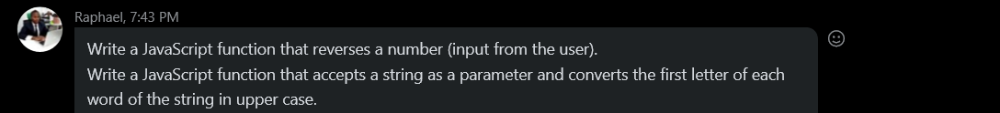

# assignments from skype and third github link

>[find it here](https://github.com/NdauwaRafael/javascriptPracticeLesson/blob/lesson-4-arrays/arrays_assignment.md)

>Questons - Reverse and Uppercase

>Number 8 - Find sunday

Write a JavaScript program to find the 1st January is being a Sunday between 2014 and 2050.
